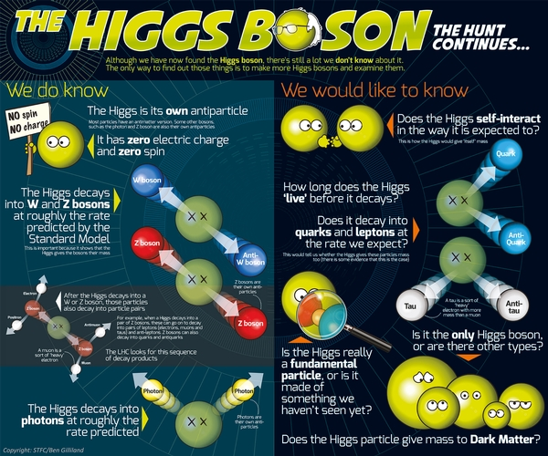

## Introduction
On 4 July 2012, the discovery of a new particle with a mass between 125 and 127 GeV at CERN was announced. Since then, the particle has been shown to behave in many of the ways predicted for the Higgs particle by the Standard Model, a theory that has been established since the 1970s. This new particle has been found to have even parity and zero spin, two fundamental attributes of a [Higgs boson](https://home.cern/science/physics/higgs-boson). This also means it is the first elementary scalar particle discovered in nature. On 8 October 2013 the [Nobel prize in physics](http://www.nobelprize.org/nobel_prizes/physics/laureates/2013/) was awarded jointly to François Englert and Peter Higgs “for the theoretical discovery of a mechanism that contributes to our understanding of the origin of mass of subatomic particles, and which recently was confirmed through the discovery of the predicted fundamental particle, by the ATLAS and CMS experiments at CERN's Large Hadron Collider”.

The nature and properties of this field are now being investigated further, using more data collected at the LHC. Though in-depth research shows the particle continuing to behave in line with predictions for the SM Higgs boson, more studies are needed to verify with higher precision that the discovered particle has all of the properties predicted, or whether, as described by some theories, multiple Higgs bosons are responsible for the Electroweak Symmetry Breaking. 

On the one hand, unravelling the mysteries of the Higgs boson will not only just help us understand why the Universe is as it is now. It’s like taking a time machine back to when the cosmos was in its infancy – just after the Big Bang created everything. This can give us a glimpse of when the Higgs field first appeared, and helped to shape the Universe we know today. It could even decide the fate of the Universe.

On the other hand, the SM is not complete in itself as it fails to explain many theoretical problems or expiermental phenomena in nature, such as the strong CP problem, neutrino oscillations, matter–antimatter asymmetry, and the nature of dark matter and dark energy, etc. Many extensions of the SM at higher energies call for an enlargement of the EWSB sector. Hence, direct searches for additional scalar states can provide valuable insights on the dynamics of the EWSB mechanism. The Higgs boson also offers an excellent tool to probe new physics beyond the SM.

## Off-shell Higgs and total width measurements

## Higgs spin and CP measurements

## Probing new physics via the Higgs portal
